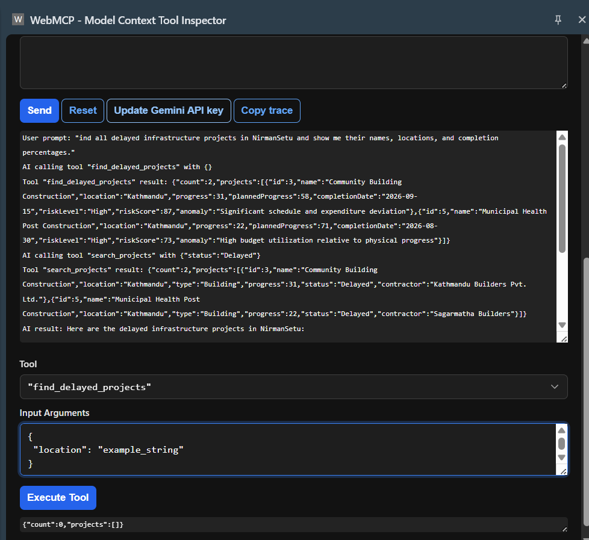

# NirmanSetu

**Government Infrastructure Monitoring & Transparency Platform**

NirmanSetu is a WebMCP-powered platform designed to monitor government infrastructure projects, track project progress, identify delays and risks, and provide AI-assisted access to project information.

## Live Demo

https://nirman-setu-webmcp.vercel.app/

## Key Features

* Infrastructure project dashboard
* Project progress monitoring
* On Track, At Risk, and Delayed status tracking
* Project location and map visualization
* Contractor information
* Project verification and evidence tracking
* AI-powered project monitoring
* Project reports
* WebMCP integration for AI-agent interaction


## Future Improvements

* Connect the platform to a production backend and government project databases
* Implement real-time project progress and financial data updates
* Add GPS-based and timestamped project evidence verification
* Integrate automated image and document analysis for construction monitoring
* Improve AI-based risk detection and delay prediction
* Add role-based access for government officials, contractors, and administrators
* Implement notifications for project delays, risks, and upcoming milestones
* Add advanced analytics and project performance dashboards
* Deploy the complete system with secure authentication and production infrastructure

## WebMCP Integration

NirmanSetu exposes project-monitoring capabilities as WebMCP tools that can be discovered and invoked by AI agents.

### Available Tools

| Tool                    | Description                               |
| ----------------------- | ----------------------------------------- |
| `search_projects`       | Search and filter infrastructure projects |
| `get_project_details`   | Retrieve details of a specific project    |
| `find_delayed_projects` | Find delayed infrastructure projects      |
| `get_project_risk`      | Retrieve project risk information         |

### AI Agent Demonstration

Example prompt:

> Find all delayed infrastructure projects in NirmanSetu and show me their names, locations, and completion percentages.

The AI agent identifies the appropriate WebMCP tool, invokes it, receives structured project data, and generates a natural-language response.



For the detailed WebMCP implementation, see [WEBMCP.md](./WEBMCP.md).

## Technology Stack

* React
* Vite
* JavaScript
* Tailwind CSS
* React Router
* Axios
* Lucide React
* Leaflet
* WebMCP
* Vercel

## Project Structure

```text
src/
├── components/
├── pages/
├── routes/
├── webmcp/
│   └── projectTools.js
├── App.jsx
├── main.jsx
└── index.css
```

## Run Locally

Clone the repository:

```bash
git clone https://github.com/Yuvraj-Dhakal/nirman-setu-webmcp.git
```

Navigate to the project:

```bash
cd nirman-setu-webmcp
```

Install dependencies:

```bash
npm install
```

Start the development server:

```bash
npm run dev
```

The application will be available at:

```text
http://localhost:5173
```

## Production Build

To create a production build:

```bash
npm run build
```

## Repository

https://github.com/Yuvraj-Dhakal/nirman-setu-webmcp

## License

MIT License

## Author

**Yuv Raj Dhakal**

B.Sc. CSIT Student | Software Engineering Enthusiast
